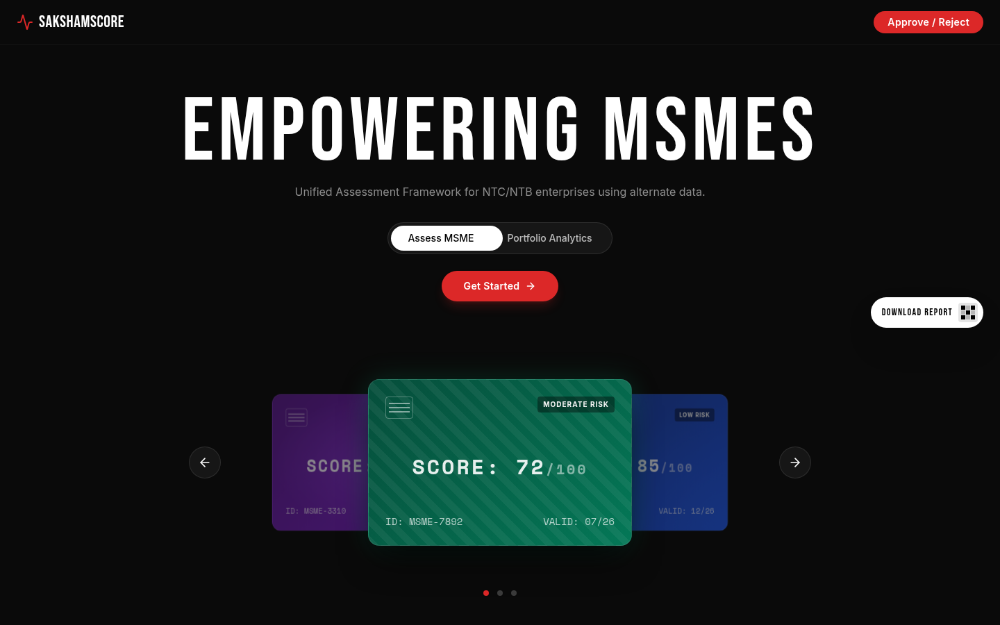
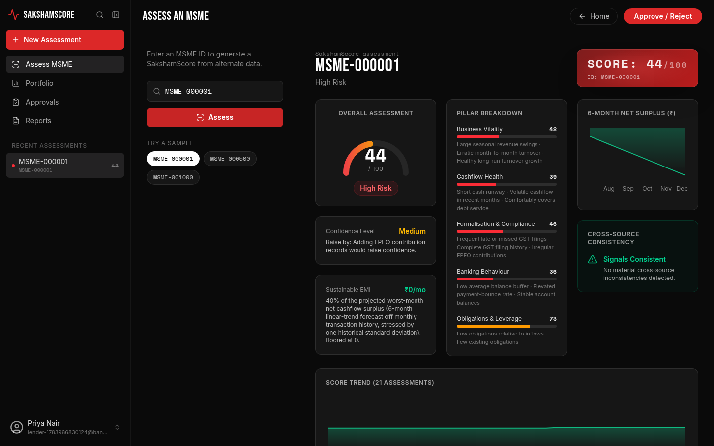
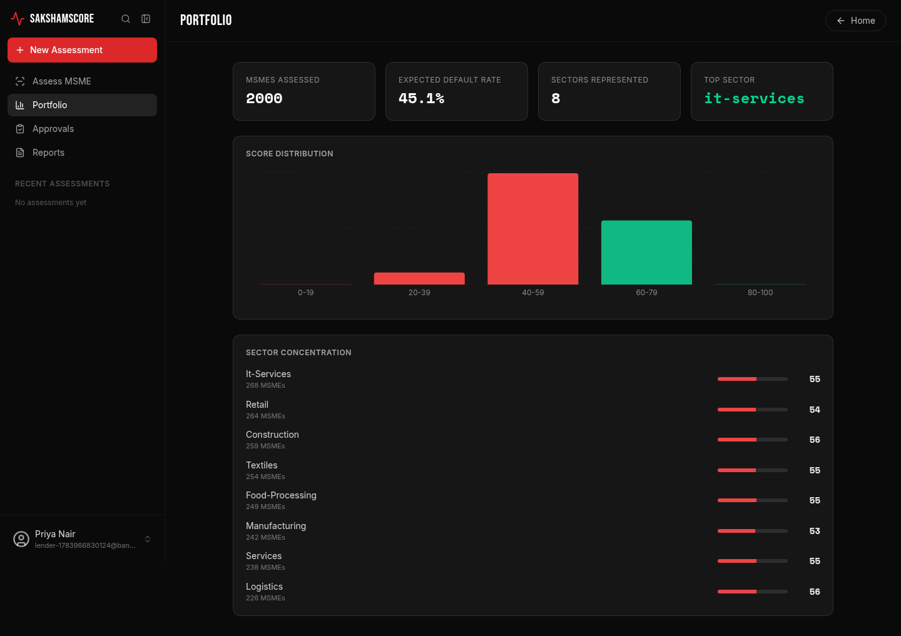
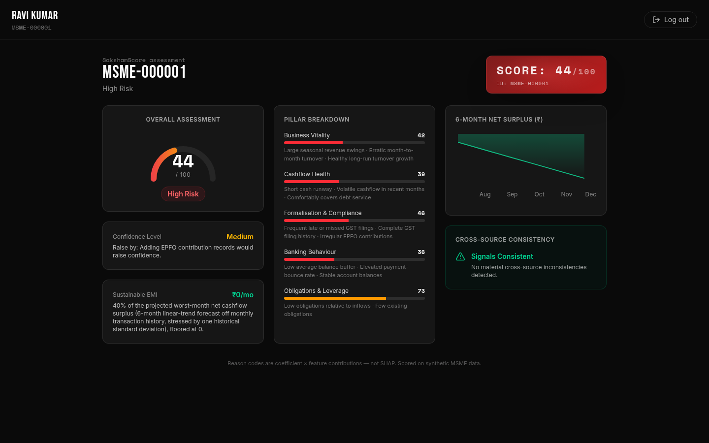

# LinkLend (SakshamScore)

Alternative credit scoring for Indian MSMEs that lack bureau history or
collateral — turns their GST filings, bank transactions, EPFO payroll, and
existing obligations into a lender-facing scorecard, with an AI layer that
explains (never computes) the score.

## Screenshots

<table>
  <tr>
    <td width="50%"><br /><sub>Landing page</sub></td>
    <td width="50%"><br /><sub>Lender: MSME scorecard with pillar breakdown, cashflow forecast, and consistency flag</sub></td>
  </tr>
  <tr>
    <td width="50%"><br /><sub>Lender: portfolio-wide score distribution and sector concentration</sub></td>
    <td width="50%"><br /><sub>Borrower: read-only view of their own scorecard</sub></td>
  </tr>
</table>

## Contents

- [Product](#product)
- [Stack](#stack)
- [Getting started](#getting-started)
- [Common commands](#common-commands)
- [Project layout](#project-layout)
- [Architecture decisions](#architecture-decisions)
- [Deploying to Vercel](#deploying-to-vercel)
- [Gotchas](#gotchas)

## Product

Lenders sign up, pull up an MSME's scorecard (`/assess`, `/card`), and browse
their full portfolio of assessed borrowers. Each scorecard blends five pillar
models into an overall score + rating band, plain-language reason codes, a
confidence measure, a sustainable EMI + cashflow forecast, and a cross-source
consistency flag. Borrowers can sign up (self-declaring their MSME) and view
their own scorecard read-only. AI features (credit memo generation, a
borrower-facing coach, scorecard Q&A, document ingestion) sit on top of the
computed scorecard and only explain it.

## Stack

- pnpm workspaces, Node.js 24, TypeScript 5.9
- API: Express 5
- DB: PostgreSQL + Drizzle ORM
- Validation: Zod (`zod/v4`), `drizzle-zod`
- API codegen: Orval (from OpenAPI spec)
- AI layer: Groq (`groq-sdk`, OpenAI-compatible) — explains scores, never computes them
- Frontend: React 19 + Vite + wouter + TanStack Query
- Build: esbuild (ESM bundle)

## Getting started

1. Install dependencies (pnpm only — a `preinstall` hook refuses npm/yarn):

   ```sh
   pnpm install
   ```

2. Create a `.env` at the repo root (not committed) with:

   | Variable | Required | Notes |
   |---|---|---|
   | `DATABASE_URL` | yes | Postgres/Supabase connection string |
   | `JWT_ACCESS_SECRET` | yes | signs the 15-minute access token |
   | `FRONTEND_ORIGIN` | no | CORS origin the API accepts; the local frontend dev server runs on **4174** despite the `5173` default |
   | `GROQ_API_KEY` | no | only needed for AI features (credit memos, borrower coach, scorecard Q&A, document ingestion) — the app runs without it, but those endpoints 500 |

3. Push the DB schema and seed sample data (2,000 MSMEs, `MSME-000001`..`MSME-002000`):

   ```sh
   pnpm --filter @workspace/db run push
   pnpm --filter @workspace/api-server run seed
   ```

4. Run the app:

   ```sh
   pnpm run dev
   ```

   Frontend on `:4174`, API on `:5000`.

## Common commands

- `pnpm run dev` — frontend + API together
- `pnpm run dev:web` / `pnpm run dev:api` — just one side
- `pnpm run typecheck` — full typecheck across all packages
- `pnpm run build` — typecheck + build all packages
- `pnpm run test` — all package test suites (Vitest; `db` and `api-server` only)
- `pnpm --filter @workspace/api-spec run codegen` — regenerate API hooks and Zod schemas from the OpenAPI spec
- `pnpm --filter @workspace/db run push` — push DB schema changes (dev only)
- `pnpm --filter @workspace/api-server run train` / `run validate` — refit / evaluate the scoring models (no DB needed)
- `pnpm --filter @workspace/api-server run seed` — seed the dev Postgres DB

## Project layout

- `lib/api-spec` — `openapi.yaml`, the source of truth for the API contract
- `lib/api-zod` / `lib/api-client-react` — generated from the spec via Orval; never
  hand-edit, run `codegen` instead
- `lib/db` — Drizzle schema (`src/schema/index.ts`) + Postgres client/pool; no
  migration files, changes apply via `drizzle-kit push`
- `artifacts/api-server` — Express API: routes, scoring engine, AI features (see
  `docs/SCORING.md` for the scoring methodology)
- `artifacts/sakshamscore` — the product frontend (React 19 + Vite + wouter +
  TanStack Query); lender dashboard/portfolio/assessment views and the borrower
  scorecard view
- `artifacts/mockup-sandbox` — standalone Vite app for previewing UI mockups; not
  part of the deployed product
- `scripts` — one-off scripts (e.g. `seed-db.ts`), not part of any app's runtime

## Architecture decisions

- `/assess`, `/card`, `/me/scorecard`, and `/portfolio` read the real Postgres
  tables via `artifacts/api-server/src/data/store.ts`. The scoring core itself
  (features, model evaluation, reason codes, confidence, forecast) is pure,
  DB-independent TypeScript operating on the `MsmeBundle` domain type
  (`src/types.ts`); training/validation regenerate a deterministic synthetic
  dataset in memory (`src/synthetic/generate.ts`) rather than touching the DB.
  See `CLAUDE.md` for the full pipeline and `docs/SCORING.md` for the scoring
  methodology.
- Auth is a stateless JWT access token (15 min, httpOnly cookie) + opaque
  refresh token (7 days, hashed, rotated on every `/auth/refresh`). `role`
  (`lender` | `borrower`) and `msmeId` live in the access-token payload, so
  `requireAuth` never hits the DB per request.

## Deploying to Vercel

`vercel.json` (repo root) builds `sakshamscore` as the static site
(`outputDirectory: artifacts/sakshamscore/dist/public`) and rewrites everything
else to `index.html` for client-side routing. **Root Directory in the Vercel
project must be left blank** (repo root) — `vercel.json` and the API function
below both need to be discovered from there, not from a package subdirectory.

The API is served from the same Vercel project as a serverless function:
`api/[...slug].mjs` re-exports the pre-bundled Express app from
`artifacts/api-server/dist/vercel.mjs` (built from `src/vercel.ts`, which
exports `app` without calling `app.listen()` — that must never run in the
serverless path). It imports the built bundle rather than raw TypeScript
source because Vercel's function compiler enforces NodeNext-style module
resolution (explicit `.js` extensions on relative imports), which this
repo's source isn't written for; re-using the same esbuild bundle the
traditional server already ships sidesteps that entirely. `buildCommand`
therefore builds both `sakshamscore` and `api-server` — the bundle is
gitignored and must be produced fresh on every deploy.

Because filesystem routes (including this function) are matched before the
`rewrites` array, requests to `/api/*` reach the function and everything else
falls through to the SPA rewrite.

Set these in the Vercel project's Environment Variables (not in `vercel.json`,
since it's committed):

| Variable | Notes |
|---|---|
| `DATABASE_URL` | use Supabase's **pooled** connection string (Supavisor, port 6543); the `pg.Pool` in `lib/db` is a module-level singleton reused across warm invocations, which is what makes it serverless-safe |
| `JWT_ACCESS_SECRET` | same secret as local |
| `FRONTEND_ORIGIN` | the deployed domain (e.g. `https://your-app.vercel.app`); frontend and API share an origin here, so this mostly matters for CORS correctness, not cross-site cookies |
| `GROQ_API_KEY` | omit only if you don't need the AI features |

If AI routes (credit memos, borrower coach, document ingestion) time out under
Vercel's default serverless function duration limit, raise `maxDuration` for
`api/[...slug].mjs` via the `functions` key in `vercel.json` (limit depends on
your Vercel plan).

## Gotchas

- `@workspace/api-server`'s tests hit the real dev database directly (no
  test-DB isolation) — `set -a && source .env && set +a` before running them,
  since Vitest doesn't load `.env` itself.
- Don't add an "only run if invoked directly"
  (`import.meta.url === process.argv[1]`) side-effect guard to any file
  reachable from `features/`, `scoring/`, `data/`, or `routes/`. esbuild
  collapses every bundled module's `import.meta.url` to the bundle's own path,
  so that guard evaluates true on *every* server startup — this once caused a
  dev-only DB-seeding `main()` to truncate and reseed the real DB on login,
  and then call `pool.end()` on the pool auth routes depend on. Seeding logic
  now lives only in `scripts/seed-db.ts`, run directly via `tsx`.
- Re-run `pnpm --filter @workspace/api-server run train` (and review the diff
  to `scoring/model-artifact.generated.ts`) if you change
  `features/catalog.ts` or `features/compute.ts`.

---

See `CLAUDE.md` for the working agreement Claude Code follows in this repo,
and the `pnpm-workspace` skill for deeper workspace/TypeScript setup details.
